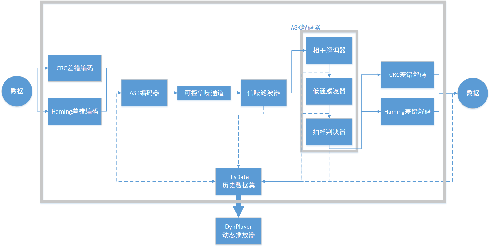
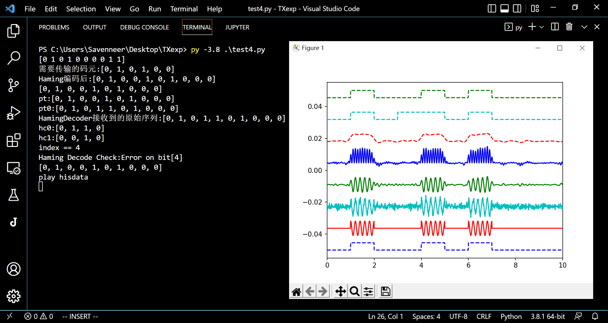

# PySiiS

## 什么是可视化框架PySiiS ?

这是一个简单的基础通信系统可视化框架，可以被用来组合不同类型的通信系统组件。

## 主程序框架

```
[data]
    =>差错控制输入
        =>数字调制输入
            =>可控误差信道
        =>数字调制输出
    =>差错控制输出
=>[data]
```

框架基于``matplotlib``实现了可视化与组件化操作流程，其原理图如下：




## 通用数据包

* ``data.py``中的``class DataPack``是一个通用的数据流传输包裹。

* 内置信号采样的配置信息和离散采样结果。其格式是``numpy.ndarray``，可以很好地运用到相关数学计算中。


## 差错控制器

* 我们默认提供了Haming和CRC差错控制器，你可以参照``haming.py``和``crc.py``设计你自己的差错控制模块。

* 我们建议差错控制模块实现``class.errctl_encode(signals=[])``方法以完成数字信号的编码，并通过``class.errctl_decode(DataPack)``进行解码。

* 你需要在内部提供``.state``变量用于在主程序反馈你的ARQ状态消息。

## 信号转换流

* 主程序中预先定义了转换列表``T=List()``，你可以将实例化后的对象中的函数地址传入该列表，框架将会自动对列表中的每个组件的输出结果进行历史数据收集和可视化。

* 需要注意的是，你必须保证``T``中的每个函数的输入和输出必须是``DataPack``格式。

```python
# DataPack信号转换列表
T = [
    ASK.encode, # ASK编码
    chn.transport, # 信道传输
    nflt.fliter, # 噪声过滤
    ASK.decode_stage1, # 相干解调
    ASK.decode_stage2, # 低通滤波
    ASK.decode_stage3, # 抽样判决
    hmctl.errctl_decode, # Haming差错控制
    # crctl.errctl_decode, # CRC差错控制
]
```

## 历史数据包

* ``class HisDataGrp``是用于存放各个阶段的信号离散数据的数据集。其内置方法``HisDataGrp.addData(DataPack)``用于向内部添加产生的数据。

* 需要注意的是，你必须保证你传入的各个``DataPack``具有相同的采样频率。

## 动态播放器

* ``class DynPlayer``适用于动态可视化播放``HisDataGrp``数据的类。它能够按照``addData()``添加的信号的顺序依次排列信号波形图，用于展示不同处理阶段信号的特征。

* ``DynPlayer.setXX(pack.t)``用于设置信号驱动流。pack.t本质上就是波形图的采样横坐标形成的点集合。

* ``DynPlayer.play(hisdata=HisDataGrp,xlims=(0,pack.grpsize))``使用``matplotlib.pyplot``播放波形图。播放完成后不会自动退出。自动退出功能请使用``DynPlayer.autoplay()``函数。


## 使用示例




